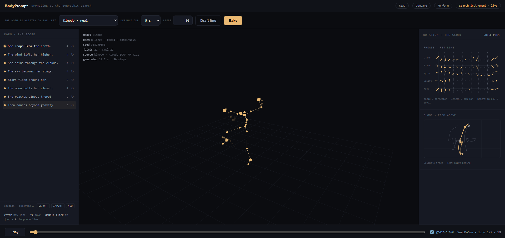
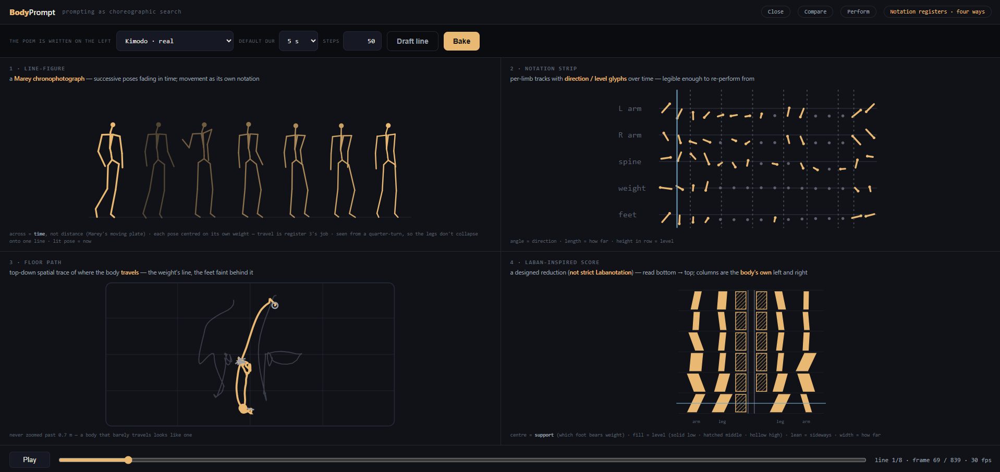
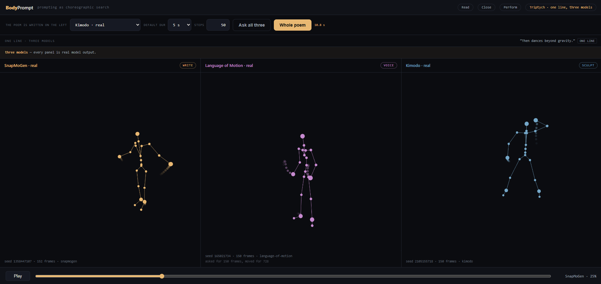

# BodyPrompt

**Prompting as Choreographic Search.**
A practice-based artistic research project by William Wong / Into Storymode.

BodyPrompt investigates **prompting as a form of choreographic search**. Rather than
treating a prompt as a one-off instruction for generating movement, the project explores
prompting as an *iterative dialogue* in which human intention and generative AI
progressively search for a movement that resonates with a poetic theme. It is not a new
motion-generation system — it is **a new way of thinking about how humans and generative
AI can search together for expressive movement**. The software in this repository exists
to support that research; it is not the contribution.

> **Research question.** How does prompting become a *choreographic search* — an
> open-ended, embodied dialogue in which human intention and generative AI co-evolve
> toward movement that embodies a poetic theme, rather than a command that retrieves one
> "correct" movement from language?

---

## Research method — an open-ended search

BodyPrompt treats movement-making as a search, not a lookup. The loop is iterative and
deliberately has **no evaluation step — only exploration**:

```
   poetic theme
        ↓
      prompt  ──────────────┐
        ↓                    │
  AI movement generation     │
        ↓                    │  reflection reshapes
   visualisation             │  the next prompt —
   (stick figures /          │  human and AI both
    notation)                │  shape what comes next
        ↓                    │
     reflection ─────────────┘
        ↓
   refined prompt → … → the search continues
```

Three commitments define the method:

- **There is no single correct movement.** The goal is an expression that *resonates*
  with the poetic theme, not one that is "faithful" to the words.
- **Variation is inspiration, not error.** The variability of generative systems is
  treated as a creative resource — each generation is a chance to discover unexpected
  qualities of movement.
- **Human and AI co-evolve.** Reflection on what the machine produced reshapes the next
  prompt; neither the person nor the model fully determines the outcome.

The evolving sequence of prompts becomes a visible record of the creative process —
revealing not a linear workflow but an **expanding landscape of possibilities**.

---

## The poem as score

The single most important idea in BodyPrompt is not a model or a renderer — it is the way
the **search itself is kept**.



*An eight-line poem, baked continuous, generated by Kimodo. Every line keeps its own
revision count; the body carries from each line into the next.*

In an ordinary tool, revising a prompt *replaces* what came before. In BodyPrompt the search
is written as a **poem**: each line is a prompt, and the body moves continuously from one
line into the next rather than restarting at each one. The poem **becomes the artefact** —
at once research log, score, and set. Every line keeps its own history, so a revision still
never destroys what came before; the expanding landscape of possibilities lives inside each
line, while the poem holds what is being made from them.

The lines are not independent. Each is generated conditioned on the body the previous line
left behind, so **editing a line changes the future and not the past**: the lines before an
edit are untouched, and every line after it legitimately becomes something else. That
causality is the choreography, and the instrument shows it rather than hiding it.

> Until v2 this was a **branching lineage tree** — every revision a child node, the search
> spreading outward. The tree answered *what was tried*; the poem answers *what is being
> made*, which is the question the lecture performance actually asks. The retention
> principle is unchanged; only its shape is.

---

## Why stick figures?

BodyPrompt deliberately **avoids realistic human avatars**. Generated movement is shown
as animated **stick figures and movement notation**, and this is a research decision, not
a placeholder.

A realistic avatar sells an illusion — it invites you to read a *character*. A stick
figure exposes the **computational body directly**: joints, trajectories, timing, weight.
It shows what the machine actually computed, before any body is fitted on top. Like
musical notation or Labanotation, this abstraction doesn't hide the material — it makes it
**legible and comparable**, inviting interpretation rather than illusion. Foregrounding
movement itself, as the primary material of inquiry, is the point.

---

## Making movement readable — the four notation registers



Press <kbd>R</kbd> for the four **notation registers** — the same motion made legible four
ways at once:

1. **Chronophotograph** — Marey's plate: successive poses fading from past to present, so
   the whole phrase is visible at once instead of streaming past. Across **time, not
   distance**: each pose centred on its own weight, seen from a quarter-turn so the legs
   don't collapse onto one line.
2. **Notation strip** — a time-scored staff, one row per limb (angle = direction, length =
   how far, height in the row = level). Legible enough to re-perform from.
3. **Floor path** — the movement from above: the weight's trace, the feet faint behind it.
4. **Laban-inspired score** — a vertical staff read bottom → top, with a central **support**
   column (which foot bears the weight) and gesture columns for the body's own left and
   right. Fill = level (solid low · hatched middle · hollow high), lean = sideways, width =
   how far. It is a *designed reduction*, **not strict Labanotation** — designing that
   reduction is itself part of the research.

**No register is complete, and that is the point.** Each one throws information away, and
*which* thing it throws away is the argument: the floor path cannot show you a raised arm;
the chronophotograph drops the body's travel; the Laban score leaves forward/back to the
floor path. Reading them together — and noticing what falls between them — is the
instrument.

---

## Comparing how models read the same line — the triptych



Three models answer the same line, each **keeping its own native way of authoring** —
SnapMoGen writes, Language of Motion speaks, Kimodo sculpts. Every panel carries its seed,
its frame count and its source, so the comparison can be read rather than trusted.

Since v3 **every panel is real model output.** Until then two of the three were
hand-authored fixtures — and, as [`docs/v0-stub.md`](docs/v0-stub.md) recorded at the time,
`sum(ord(c))` for `"snapmogen"` and `"kimodo"` were congruent mod 5, so those two columns
were *identical, row for row*. The instrument asked how different models interpret the same
theme and, for three versions, could not answer at all.

<kbd>N</kbd> switches between one line and the whole poem. In whole-poem scope the panels
are **not the same kind of thing**: Kimodo carries each line into the next, while SnapMoGen
and Language of Motion generate their lines apart and lay them end to end. Each panel says
which it did. Forcing them into a common shape would have switched off the only real
continuity in the system to make the columns match — **the asymmetry *is* the comparison.**

---

## Performing the search


Press <kbd>P</kbd> and the instrument becomes a stage: the chrome falls away, the phrase the
body is answering goes large, playback slows to half speed to be followed by a body — but
the **poem keeps growing**, and you can still write and generate live, in front of the room.

The audience does not just watch generated movement — they watch the **evolution of
thought**: the phrase the body is answering right now, lit as the movement reaches it, and
the lines still waiting.

→ **[`docs/lecture-performance.md`](docs/lecture-performance.md)** — the full sequence, the
stage, and what still stands between a working instrument and a performable one.

---

## The five instruments

Each screen is a **research instrument**, answering *"how does this help the search?"* — not
*"what feature is this?"*

| # | Instrument | What it lets the research do |
|---|-----------|------------------------------|
| 01 | **Lab bench** | The basic search instrument — explore how *different prompts* generate *different interpretations* of the same poetic intention. |
| 02 | **Search instrument** | Visualises the **history of the search** — the poem retains every line and each line its own revisions, rather than replacing prior attempts; variance is shown as a ghost-cloud. |
| 03 | **Triptych** | Compares how **different AI models interpret the same poetic intention**, each keeping its own native way of authoring. |
| 04 | **Notation registers** | Makes generated movement **readable and comparable** — four notation registers — without relying on realistic human appearance. |
| 05 | **Performance mode** | Supports **live collaborative search** between performer, audience and AI during a lecture performance. |

All five exist as a real, running app. The original static mockups are kept as the first
statement of intent and need no build — just `open frontend/mockups/index.html`:

```
frontend/mockups/
├── index.html                 ← contact sheet — open this first
├── styles.css                 ← shared design system (one look across all screens)
├── 01-lab-bench.html
├── 02-search-instrument.html
├── 03-triptych.html
├── 04-notation-registers.html
├── 05-performance-mode.html
└── screenshots/               ← pre-rendered PNGs of every screen (for the abstract)
```

Each mockup is a fixed 1440×900 "device frame", so screenshots come out consistent.

---

## Current research questions

- How does prompt refinement influence the generated movement?
- Which words consistently produce similar movement qualities?
- How do different models interpret the same poetic theme?
- How does visual notation influence how a prompt gets refined?
- When does the search feel "complete"?

---

## What the instrument has shown so far

Observations, not results. Each comes from a handful of prompts and crude scalars, and each
is written down because it is the *kind* of thing this instrument exists to ask properly.

- **Both real models move far less for a poetic prompt than a literal one.** "a body
  remembers a place it cannot return to" gets a 0.03 m wrist span from SnapMoGen and 0.18 m
  from Kimodo; "A person walks forward and turns around" gets 3.95 m and 2.38 m. SnapMoGen is
  the more literal of the two, but neither does much with poetry. **From five prompts and two
  crude scalars** — and precisely the question the research is for.
- **Language of Motion barely travels.** 0.09 m of root translation against Kimodo's 2.11 m
  and SnapMoGen's 3.89 m on the same phrase. Real articulation — the wrists span
  0.46–0.63 m — but almost no displacement. From three prompts.
- **Real siblings vary the legs far more than the fixtures did.** The stub damped ankles and
  knees on an assumption of planted feet that the model does not share — mis-modelling leg
  variance by eleven to twenty times. Designing notation against stub data taught the
  notation the wrong thing.
- **About three quarters of the difference between ghost-cloud siblings is how far each one
  travels**, not how it moves. Displacement is real variance and stays in the performance
  view: how far a body goes is part of how the model read the prompt.

Measurements and method: [`docs/v1-implementation.md`](docs/v1-implementation.md) and
[`docs/v3-models.md`](docs/v3-models.md).

---

## What is real, and what is a stand-in

**Please read this before drawing any conclusion from a screenshot.** The rule the project
holds itself to: *a screenshot must never be able to outrun the implementation.*

**The four screenshots above are real model output** — the poem, the registers and the
triptych were generated by Kimodo, SnapMoGen and Language of Motion running locally, not by
the fixtures. The triptych's banner in that image reads *"three models — every panel is real
model output"*, and it builds itself from `/health` rather than being typed next to the
screen.

But that is a configured machine, and the default is not:

- **In default fixture mode there are five hand-authored motions in the entire system**, and
  every movement is one of those five wearing a little seeded jitter. The prompt is not
  understood — the motion is chosen by hashing it — and the ghost-cloud is seeded
  perturbation. Every screenshot in `frontend/mockups/screenshots/` shows this.
- **Only an output whose runtime provenance names a model is real model output** —
  `source: kimodo`, `source: snapmogen`, `source: language-of-motion`. `source: fixture` is a
  hand-authored stand-in, whatever the dropdown says. The UI derives that label from
  `/health`, not from the selected name.
- **All three models are real as of v3** (2026-08-24) — but only when each is configured with
  a worker, and each is real independently of the others.
- **Language of Motion answers a 5 s request with ~27 s of motion**, which the worker
  truncates. It has no length conditioning on the released checkpoint, and the triptych says
  `asked 150 frames, moved 800` rather than cropping quietly.
- **A motion served from memory is the same generation, not a fast one.** Its telemetry reads
  `memory · remembered · not regenerated`, and the seconds beside it are the original run's —
  never refreshed into a claim about how quick the model is.
- **In the triptych's whole-poem scope the three panels are not the same kind of thing.** One
  is continuous and two are lines laid end to end. Each panel says which, and a screenshot
  without those labels is not a model comparison.

⚠️ **[`docs/v0-stub.md`](docs/v0-stub.md) is the complete inventory of what is still faked** —
every stand-in, written down in one place, so that nothing in a screenshot can be mistaken
for a finding. Read it before citing anything this tool shows you.

---

## Run it

Fixture mode needs no GPU, no Hugging Face account and no model downloads:

```bash
cd service && uv run uvicorn app.main:app --port 8000   # terminal 1
cd frontend/app && pnpm install && pnpm dev             # terminal 2
```

Open <http://localhost:5173>, type a phrase, press **Generate**.

- 📖 **[`docs/usage.md`](docs/usage.md)** — every view, control and keyboard shortcut.
- 🔧 **[`docs/architecture.md`](docs/architecture.md)** — how it is built, and how to run the
  three real models on a GPU.

## Where the rest lives

| | |
|---|---|
| [`docs/abstract.md`](docs/abstract.md) | The accepted abstract — the canonical framing and vocabulary |
| [`docs/lecture-performance.md`](docs/lecture-performance.md) | The live performance this is all built for |
| [`docs/architecture.md`](docs/architecture.md) | The adapter pattern, the stack, running the real models |
| [`docs/roadmap.md`](docs/roadmap.md) | Versions, parked items, and questions left open |
| [`docs/usage.md`](docs/usage.md) | The full guide to the instrument |
| [`docs/motion-schema.md`](docs/motion-schema.md) | The canonical motion exchange format |
| [`docs/session-schema.md`](docs/session-schema.md) | The exported session file — where a search lives |
| [`docs/v0-stub.md`](docs/v0-stub.md) | The honesty inventory — everything still faked |
| [`docs/v1-implementation.md`](docs/v1-implementation.md) | Kimodo: local-GPU setup and measurements |
| [`docs/v3-models.md`](docs/v3-models.md) | SnapMoGen and Language of Motion: verification and findings |

Repo: **Public**.

## Licence

Code: **MIT**. Writing and mockups: **CC BY 4.0**.

The models carry their own terms, and two are not this repository's to redistribute:
SnapMoGen is under **Snap Inc.'s non-commercial research licence**, and the SMPL-X body model
Language of Motion needs is **MPI-licensed behind a human registration**.

---

BodyPrompt investigates prompting as a **collaborative search** through which humans and
generative AI gradually discover expressive movement *together* — reframing prompting
itself as a choreographic practice in which language, movement and computation
continuously shape one another, rather than a command that retrieves a single "correct"
movement from language.
