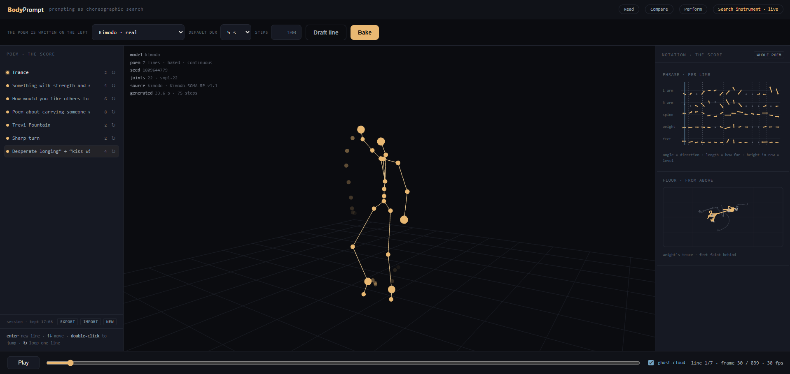
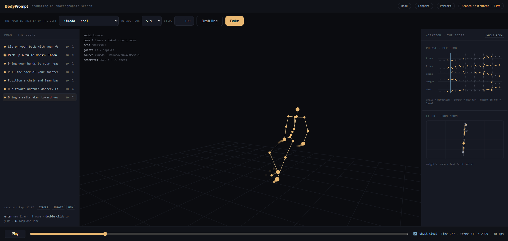
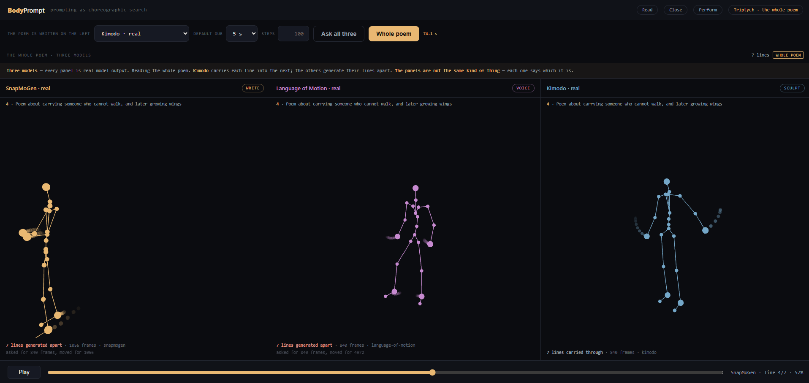

# Day 1 — 2026-08-25

> **Can text-to-motion AI generate *dance*, or only body movement?**

The first research session on the finished v3 instrument. All three models real, running
locally, answering the same prompts.

The prompts are **Pina Bausch's**, because Bausch is the clearest historical case of the thing
this project is about: from around 1978 she stopped giving dancers movement and began **asking
questions and collecting their responses**. Around 96 prompts during the creation of
*Wiesenland* (2000) alone. The dancers answered with movement, speech, an action, a memory or a
small scene, and Bausch selected, repeated and reorganised those answers into a work.

What makes them a useful test is the **distance** between cue and response:

| Bausch's cue | The dancer's documented response |
|---|---|
| "Sharp turn" | dancers catch and spin one another at speed |
| "Trevi Fountain" | a woman hangs backwards over a chair, water poured into her mouth, spat back |
| "Trance" | a trio — one dancer's feet against a wall, two others lifting and lowering her |
| "How would you like others to treat you?" | running his fingers through his hair |

The dancer does not illustrate the word. **They make something because of the word.** That
distinction is what the day was built to test.

---

## What was run

Four batches, 58 stored motions plus 34 motion records in six session files.

| batch | prompts | condition |
|---|---|---|
| **A** | 5 cues from *Für die Kinder von gestern, heute und morgen* (2002) | English, as a five-line poem |
| **A′** | the same five cues | **Klein's original German** — a control |
| **B** | 9 cues from *Wiesenland* (2000) | English, deliberately mixed prompt types |
| **exp 2** | 7 cues, each in two versions | **original prompt** vs **direct transmission** |

Every batch went through all three models. Kimodo stitched the poems whole
(`multi_prompt: true`); SnapMoGen and Language of Motion generated their lines apart, because
they declare `can_stitch_poems: false`. The panels are not the same kind of thing, and each one
says which it is.

---

## What was found

### 1. The models have retrieval where a dancer has association

Batch A's cues name **actions** — *shake someone awake*, *make yourself small*. Batch B's mostly
name **things** — Budapest, Danube, Landscape, Baths. The models do markedly worse on the
second kind, and **they fail in different directions**.

Kimodo stops. Its answer to a proper noun is arrest: *Budapest* 0.06 m/s of wrist speed,
*Yes* 0.09, *Landscape* 0.09, with wrist spans of 4–5 cm. SnapMoGen substitutes the nearest
physically describable action — *Danube* becomes locomotion, *Baths* becomes something like
washing (54% of frames with hands above the shoulder, the fastest wrists in that batch).

Neither is association. Brinkmann answering *"Trance"* with three bodies against a wall is a
lateral move **away** from the word. SnapMoGen retrieving washing from *"Baths"* is a move
**toward** its most literal physical correlate. From outside they look alike — a word producing
unexpected movement — and they are opposites.

### 2. The models respond to the string, not to the cue

Batch A′ re-ran batch A in Bausch's original German. **These are the same cue**; the difference
between the columns is an artefact of translation scholarship, and carries no choreographic
information. A German-speaking dancer answers both the same way.

Wrist speed (m/s) and hands-above-shoulder, English → German:

| cue | Kimodo | SnapMoGen |
|---|---|---|
| shake someone awake → *jemanden wachrütteln* | 1.77 / **59%** → 1.58 / **8%** | **1.38 → 0.18** |
| something on your mind → *…auf dem Herzen liegt* | 0.50 / **69%** → 0.75 / **0%** | 0.10 → 0.09 |
| make yourself small → *sich klein machen* | **0.03 → 0.14** | **0.27 → 1.56** |

Kimodo's raised arms vanish. SnapMoGen doesn't degrade — it **inverts**: its most active English
line becomes a near-freeze, and its quietest becomes its most active. For a phrase meaning
*make yourself small* it produces the largest motion in the batch.

**And it fails loudly rather than quietly.** A clean failure would be a freeze or a refusal.
Instead T5-base — trained on English — lands the German somewhere arbitrary and the model
confidently generates a large, specific, wrong motion. Nothing on screen would tell you.

One reading survives translation: *sich klein machen* is the quietest line in both German
bakes, exactly as *make yourself small* was quietest across all six English ones. It is the
most literally physical of the five, and Kimodo has by far the largest text encoder.

**This is cheap and reusable as a method.** Re-run any prompt in another language. A model
reading meaning should converge or fail visibly. **Divergence with confidence is the signature
of a system matching on surface form** — and it is invisible from inside the instrument,
because every panel looks equally sure of itself.

### 3. Each model sits at a different point on the transmission–generation spectrum

Experiment 2 put seven cues through two conditions: Bausch's original, and the documented
dancer response rewritten as movement instructions.

**SnapMoGen executes the transmissions, literally.** *"Lie on your back with your feet pressed
against the wall"* → pelvis at 0.06 m, head at 0.17 m: **it lies down**. *"Run toward another
dancer"* → **6.52 m of travel**, the largest motion of the day. *"Bring your hands to your head,
run your fingers through your hair"* → **80% of frames above the shoulder**. Four of seven pairs
show it visibly performing the instruction it was given.

**Kimodo inverts.** It gave *"Trance"* a wrist speed of 1.31 and 18% above shoulder. It answered
five explicit sentences of physical instruction with **0.04 m/s and 3 cm wrist spans** — a total
freeze.

**Language of Motion does not notice the difference at all.** Wrist speed across the originals:
0.95, 0.56, 0.75, 0.84, 0.64, 0.54, 0.74. Across the transmissions: 0.78, 0.52, 0.61, 0.56,
0.70, 0.89, 0.67. The same band. A single word and a five-sentence movement instruction produce
statistically indistinguishable output.

So the day's answer is not *"they make body movement instead of dance."* It is that **each model
sits at a different point on the spectrum from prescribed geometry to open meaning, and none of
them sits where Bausch was working.**

### 4. Language of Motion never raises its arms

**Across 33 distinct prompts, in two languages, at every level of specificity — from the single
word *Yes* to a five-sentence instruction — the wrists never once passed the shoulders.** Three
of those prompts were explicitly about strength and energy.

Its wrist speed also stays in the same 0.6–1.4 band regardless of what it is asked. That
flatness is now the observation: it is consistent with **very weak text conditioning**, and it
is directly testable by putting maximal-contrast prompts, or nonsense, through it and seeing
whether the band moves at all.

### 5. Kimodo's stitching has no restoring force

This is the finding the instrument produced about *itself*, and it is the one worth acting on.



*Batch: the seven original cues. The body is upright, ghost-cloud siblings faint behind it.*



*The same model, the same session, the seven transmissions. Frame 411 of 2099, and the body is
already down.*

Pelvis height across the transmission poem, line by line:

```
0.66 → 0.65 → 0.62 → 0.52 → 0.51 → 0.50 → 0.45 → 0.07
```

Monotonic, and it never recovers. By the last line the head is at **0.07 m** — flat on the
floor — for the instruction *"bring a saltshaker toward your face or mouth."*

The originals poem, same model, same session: **0.98 throughout. No drift at all.**

So this is not a general defect. It is what happens when one line drives the body downward and
no later line can lift it. **The continuity that is v2's whole premise becomes a one-way
ratchet.** It also means the per-line readings in that poem are confounded by position — there
is no way to tell whether line 5 went low because of its text or because line 4 left it there.
Those readings are *unavailable*, not merely weak.

### 6. Length is choreographic material, and one panel silently rewrites it



*The seven original cues, whole-poem scope. Read the panel footers.*

The instrument says it plainly: SnapMoGen **"asked for 840 frames, moved for 1056."** Language of
Motion **"asked for 840 frames, moved for 4972"** — nearly six times the request, truncated back
to 840 by the worker. Only Kimodo's *"7 lines carried through"* is the poem as written.

This was recorded as a labelling concern. Batch B turned it into a research one: Bausch's cues
are short, seven of nine lines were asked at **2 s**, and SnapMoGen answered every one of them at
**4.27 s**. A nine-line poem of two-second cues has a tempo, and **tempo is part of the score**.
Answering it at twice the length is not a longer version of the same reading — it is a different
piece. The label is honest and does not help, because the distortion is in the artefact rather
than in the description of it.

Recorded in [`../roadmap.md`](../roadmap.md).

---

## The data

`data/2026-08-25-day-1/` holds the six session files from experiment 2 — 34 motion records,
25 MB. Import one with **IMPORT** in the session bar. They are self-contained: no GPU, no
network, nothing running.

| file | the **bake** is | the **per-line drafts** are |
|---|---|---|
| `originals-kimodo-1545.json` | kimodo, 840 fr | *none — this file has only the bake* |
| `originals-snapmogen-1547.json` | **kimodo**, 840 fr | snapmogen, 7 lines |
| `originals-language-of-motion-1552.json` | **kimodo**, 840 fr | language-of-motion, 7 lines |
| `transmissions-kimodo-1555.json` | kimodo, 2100 fr | *none* |
| `transmissions-snapmogen-1557.json` | **kimodo**, 2100 fr | snapmogen, 7 lines |
| `transmissions-language-of-motion-1559.json` | **kimodo**, 2100 fr | language-of-motion, 7 lines |

⚠ **The bake in every file is Kimodo's.** The poem was baked with Kimodo, then the per-line
drafts were regenerated with each model in turn. Playing the bake in
`transmissions-snapmogen-1557.json` shows **Kimodo**, not SnapMoGen. Every figure above uses the
bake for Kimodo and the line drafts for the other two.

The other three batches produced 58 motions that are **not** in this repository, because the
triptych's motions have no export path — see the "From v4" entry in
[`../roadmap.md`](../roadmap.md). They were recovered from the service's motion store by hand.
That gap is the single thing this session most wanted and could not have: **a comparison you
cannot keep is a comparison you cannot cite.**

---

## What this session owes

Two things about the prompts, before any of experiment 2 is cited:

- Pair 6's original was sent as `Desperate longing” → “kiss with saltshaker` — stray smart
  quotes and an arrow carried over from a markdown table. The model received punctuation noise
  and two phrases joined by an arrow. That line's reading is contaminated.
- Pair 3's original is a *description*, not a stimulus: *"Poem about carrying someone who cannot
  walk, and later growing wings"* is a label for the Kányádi poem Bausch read aloud. That pair
  does not test what the other six test.

Five of seven pairs are clean.

**And the experiment this session makes necessary is the one it did not run.** The background
reading proposes a three-level spectrum — **A** poetic prompt, **B** extracted choreographic
task, **C** direct transmission. Day 1 ran A and C. Level B is the rule rather than the meaning
or the geometry: *"maintain contact with a wall while others change your body's relationship to
gravity."* If SnapMoGen degrades from C to B and Kimodo improves from A to B, each model is
located with three points instead of two.

That is a rewrite of seven prompts, not a line of code.

---

**Caveats carried by everything above:** one seed per model per line in the triptych; three or
five seeds for Kimodo alone; the measurements are scalars computed from joint positions, **not
watched motion**; and durations differ between conditions, so only per-second and per-frame
measures are used in any claim. Kimodo's transmission poem is confounded by drift.

Observations, not results.
