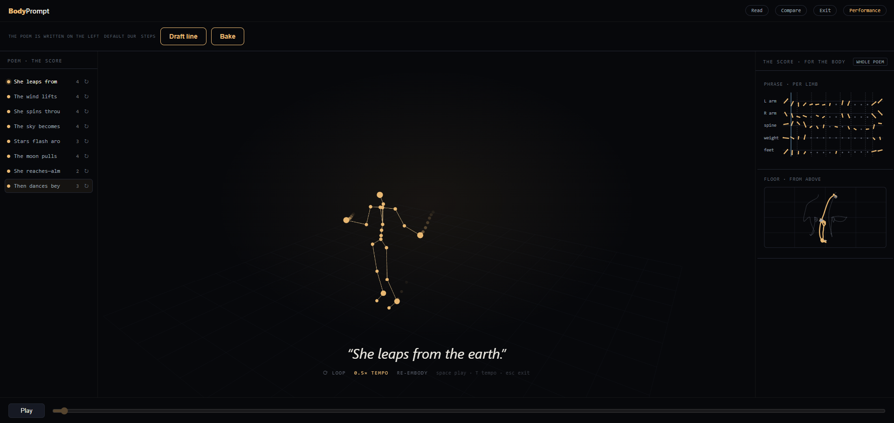

# The lecture performance

BodyPrompt is designed to be **performed live**. This page collects everything about that
performance in one place: what it is for, the sequence, the stage the software provides, and
what still stands between a working instrument and a performable one.

> The lecture performance demonstrates this search process live. Beginning with a
> short poetic phrase, BodyPrompt generates multiple movement interpretations using
> AI motion-generation models. […] The evolving sequence of prompts becomes a visible record
> of the creative process, revealing not a linear workflow but an expanding landscape of
> possibilities.
>
> — [`abstract.md`](abstract.md), the canonical framing

The performance is not a presentation *about* the research. It **is** the research, done in
front of people: the search is performed rather than reported.

---

## The sequence

1. **Introduce a poetic theme** — a short phrase to search from.
2. **Begin prompting** — turn the theme into a first prompt.
3. **Generate movements** — the models offer several interpretations.
4. **Compare outputs** — read them as notation, side by side.
5. **Discuss discoveries** — what unexpected qualities appeared?
6. **Refine the line** — reflection reshapes it, and every line after it in turn.
7. **Repeat** — the search continues, live and visible.
8. **Reflect** — on the expanding landscape the search has drawn.

**Steps 5 and 8 cannot be built.** They are a person talking to a room. Everything the
software does is in service of making those two moments possible.

---

## Performance mode — the stage (v4a, shipped)

Hit **Perform** (or press <kbd>P</kbd>) for the projectable stage: the instrument chrome
falls away, the phrase goes large, playback slows to half speed to be followed by a body —
but the **poem keeps growing** and you can still write and generate live, in front of the
room.

- The background drops to near-black, chosen for a projector in a dark room.
- Playback re-seats to **0.5× tempo**, because a body has to be able to follow it.
- The phrase the body is answering right now is set large and centred; the lines still
  waiting stay in the poem on the left.
- <http://localhost:5173/?perform=1> boots straight into it, for plugging into a projector.
  `?compare=1` opens the triptych directly; `?registers=1` opens the notation registers.

| key | |
|---|---|
| <kbd>P</kbd> | enter / leave performance mode |
| <kbd>space</kbd> | play / pause |
| <kbd>T</kbd> | cycle tempo (0.5× → 0.25× → 1×) |
| <kbd>R</kbd> | read the four notation registers |
| <kbd>C</kbd> | compare models (the triptych) |
| <kbd>N</kbd> | one line / the whole poem |
| <kbd>G</kbd> | ghost-cloud on / off |
| <kbd>esc</kbd> | leave the current mode |

In performance this matters twice over. The audience does not just watch generated
movement — they watch the **evolution of thought**: the phrase the body is answering right
now, lit as the movement reaches it, and the lines still waiting.

---

## What stands between working and performable

The instrument works. That is not the same as being ready to carry a room, and the gap is
worth naming before v4 is planned rather than discovered on the night.

**Latency is now a dramaturgical problem, not a technical one.** Measured on the target
machine for 5 s of motion: SnapMoGen 3.2 s, Kimodo 9.8 s, Language of Motion 17.2 s. A
triptych generation is dead air for as long as its slowest panel — seventeen seconds of
silence, or seventeen seconds you fill deliberately. That is a choice to make in rehearsal,
not a number to optimise.

**Rehearsal and honesty pull against each other here.** The motion store means a rehearsed
phrase replays instantly — but a replay is labelled `memory · remembered · not regenerated`,
because it *is* the earlier generation and not a fast one. Whether a performance should lean
on that, and whether the label is a problem or the most honest thing on the screen, is a
question for the performance and not for the code.

**Memory has no margin.** 19.7 of 23 GB with all three models resident. It holds; the
failure mode mid-performance would be the operating system killing Kimodo.

**Nobody has verified the instrument in a browser by hand.** Every check so far has been a
test suite or a `curl`. For an event where the screen *is* the artefact, that is the first
gap to close.

---

## Status

**v4a — performance mode — is done.** v4 is the performance itself, and it is the only
remaining roadmap row that is not software. See [`roadmap.md`](roadmap.md).
